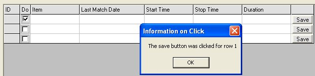



## CoolFlex2 \*updated\*

### Description

This is an alteration to a control I found on freevbcode.com. You can set cells to checkboxes, comboboxes, textboxes or a button.

I previously submitted a version here. I have now added the ability to set the check mark on load by setting the cell value to "C".

I do not know how to save the colors on the control. I will leave that to someone else.

This could very easily be adapted to fill the grid from a database.

(I resubmitted this as new since I dont think it overwrote the original)
 
### More Info
 

             |
---                |---
**Submitted On**   |2003-04-22 13:54:22
**By**             |[Phred](https://github.com/Planet-Source-Code/PSCIndex/blob/master/ByAuthor/phred.md)
**Level**          |Intermediate
**User Rating**    |4.4 (22 globes from 5 users)
**Compatibility**  |VB 6\.0
**Category**       |[Custom Controls/ Forms/  Menus](https://github.com/Planet-Source-Code/PSCIndex/blob/master/ByCategory/custom-controls-forms-menus__1-4.md)
**World**          |[Visual Basic](https://github.com/Planet-Source-Code/PSCIndex/blob/master/ByWorld/visual-basic.md)
**Archive File**   |[Flexgrid21578024222003\.zip](https://github.com/Planet-Source-Code/phred-coolflex2-updated__1-44962/archive/master.zip)

